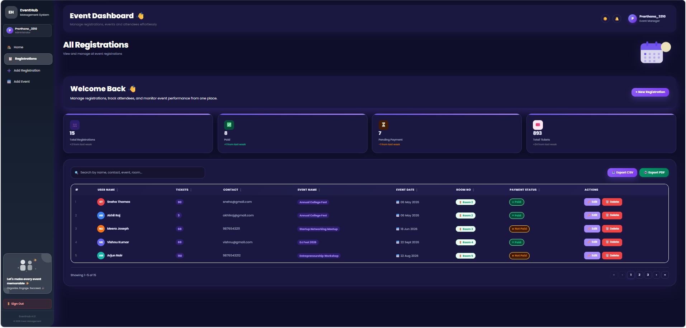
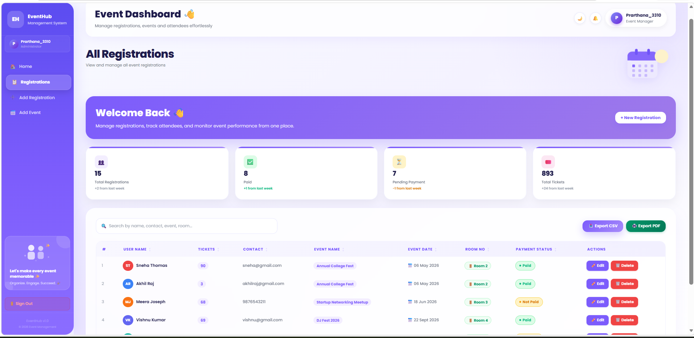
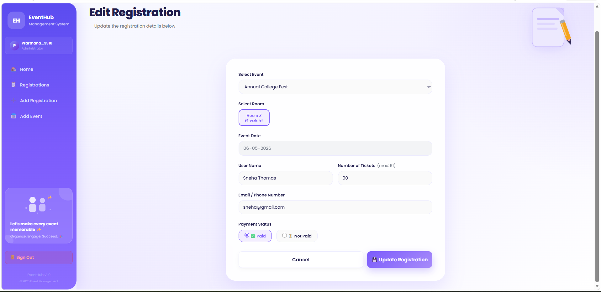
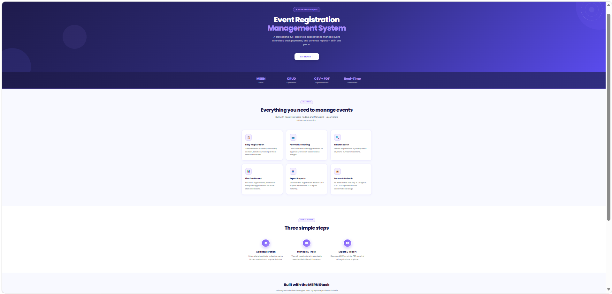
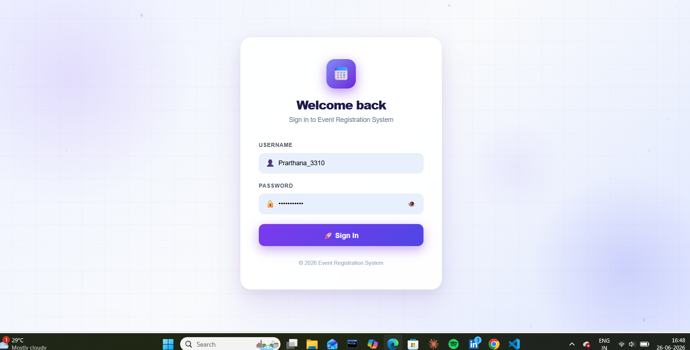
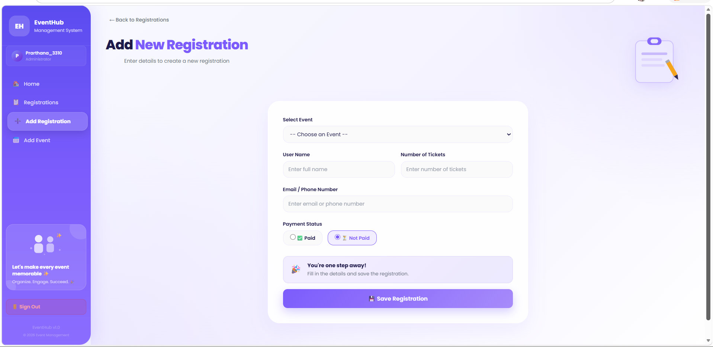

# 📅 Event Management System

A full-stack **Event Management & Registration System** built using **MongoDB, Express.js, React, and Node.js (MERN Stack)**.

The application provides secure user authentication, event management, attendee registration, and a responsive user interface with dark/light mode support.

---

# 🚀 Features

## 🔐 Authentication
- User Registration
- User Login
- Password Hashing using Bcrypt
- JWT Authentication

## 📅 Event Management
- Create Events
- View Events
- Edit Events
- Delete Events

## 🎟️ Registration Management
- Register Participants
- View Registration Details
- Edit Registration
- Delete Registration

## 🌗 User Interface
- Responsive Design
- Dark & Light Mode
- Clean Dashboard

---

# 🛠️ Tech Stack

### Frontend
- React.js
- React Router DOM
- Context API
- CSS

### Backend
- Node.js
- Express.js

### Database
- MongoDB
- Mongoose

### Authentication
- JWT
- Bcrypt.js

---

# 📁 Project Structure

```
Event-management/
│
├── backend/
├── frontend/
├── screenshots/
└── README.md
```

---

# ⚙️ Installation

## Clone the Repository

```bash
git clone https://github.com/prarthanas3310-cmyk/Event-management.git
cd Event-management
```

## Backend Setup

```bash
cd backend
npm install
npm start
```

## Frontend Setup

```bash
cd frontend
npm install
npm run dev
```

---

# 📈 Future Improvements

- Email Notifications
- QR Code Entry System
- Admin Dashboard Analytics
- Payment Integration
- Cloud Deployment (Render & Vercel)

---

# 👨‍💻 Developer

**Prarthana S**

- GitHub: https://github.com/prarthanas3310-cmyk
- LinkedIn: https://linkedin.com/in/prarthana-s-979380332

---

# ⭐ Project Highlights

- MERN Stack Application
- JWT Authentication
- REST API
- MongoDB Database
- CRUD Operations
- Responsive UI
- Dark Mode Support

---

# 🖼️ Screenshots

## 🌙 Dark Mode



## 📊 Dashboard



## ✏️ Edit Registration



## 🏠 Home Page



## 🔐 Login Page



## 📝 Registration Page

